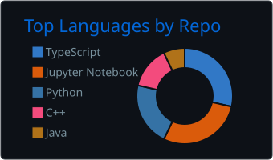
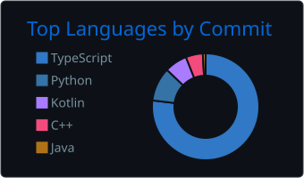

# Hi, I’m Shantnu 👋

I’m a **product-driven Software Engineer** who builds **backend-heavy systems** and **end-to-end features** with a strong focus on **reliability, correctness, and long-term maintainability**.

My background is in **distributed, correctness-critical systems** (financial workflows, event-driven services), and I’m now extending that foundation into **AI engineering** by building retrieval-based systems, evaluation pipelines, and production-safe AI workflows.

I enjoy the work that starts once something ships: handling edge cases, making systems observable, and ensuring they keep working as users and complexity grow.

## What I work with
- **Backend & Distributed Systems:** microservices, event-driven architectures, concurrency, data consistency  
- **Full-stack delivery:** clean APIs, pragmatic UI flows, strong developer experience  
- **AI Engineering:** RAG pipelines, embeddings, evaluation, guardrails  
- **Operational mindset:** monitoring, incident response, root-cause analysis, safe iteration

## Tech I work with (and keep learning)
**Languages:** Java, Python, TypeScript, SQL, C/C++  
**Backend:** Spring Boot, FastAPI, Node.js, REST / GraphQL  
**Data & Infra:** Postgres, MySQL, Redis, Kafka, Elasticsearch  
**Cloud & Tooling:** AWS, Docker, Jenkins, SonarQube, Git

## Activity

## Connect
- LinkedIn: https://linkedin.com/in/shanb007  
- Portfolio: https://shantnu-bhalla.vercel.app  
- Email: bhallashantnu07@gmail.com
